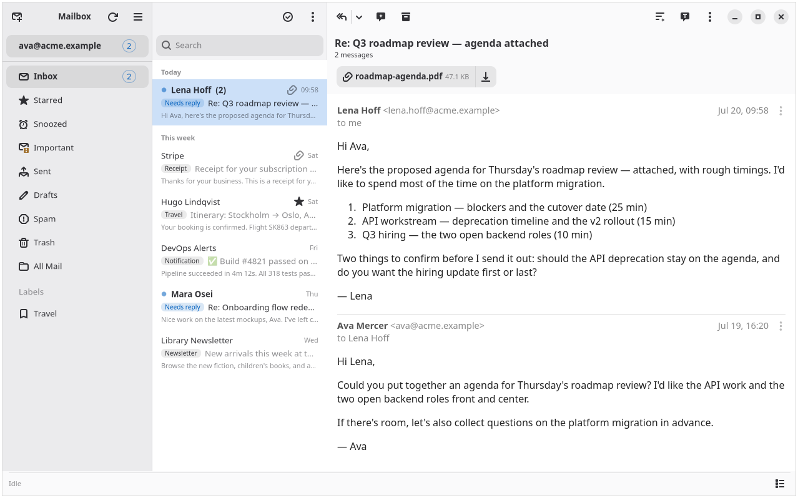

# Mailbox

A native, fast Gmail client for Linux/GNOME with AI built in.

Written in Go with GTK4 + libadwaita.

## Why This Exists

GNOME doesn't have a good modern, fast email client. Geary is buggy, Thunderbird is slow and heavy, and the rest are Electron apps or web wrappers.

Mailbox fills that gap — a native GTK4 app that's fast, small, and feels at home on GNOME, with Gmail as the backend and AI as a genuine productivity layer.

## AI Features

- **Inbox categorization** — incoming mail auto-tagged by AI (Needs reply, Calendar, Travel, Receipt, Finance, Security, Discount, Newsletter, Notification) so you can prioritize what matters
- **Thread summarization** — one-click bullet summary of long conversations, cached per thread so reopening is instant
- **Draft replies** — AI drafts a contextual reply you review before sending, with smart quick-reply suggestions
- **Subject generation** — generate a subject line from the email body
- **Grammar check** — proofread compose bodies before sending
- **Translate** — translate message bodies in place
- **Phishing analysis** — on-demand AI security review fed by sender auth signals (SPF/DKIM/DMARC) and deterministic deception detection

AI provider is user-configurable: OpenAI-compatible endpoints (including LiteLLM proxies) or Anthropic. Your API key stays in the OS keyring.

## Security

- **Sender verification** — SPF/DKIM/DMARC results shown per message
- **Deception detection** — catches display-name spoofing and deceptive links
- **Tracker blocking** — tracking pixels stripped before render
- **Sanitized rendering** — no email-supplied JavaScript can run

## Features

- **Multi-account** — connect several Gmail accounts; a sidebar switcher shows each with its own unread count
- **Undo Send** — outgoing mail is held briefly behind an Undo toast; failed sends queue to an outbox and retry in the background
- **Keyboard-first** — `j`/`k` move between conversations, `r` reply, `a` archive, `c` compose, `/` search, all while reading
- **Instant search** — full-text search (FTS5) over the cached mailbox, falling back to a Gmail server-side search when a query has no local hits
- **Selection mode** — batch archive, trash, or mark-read across any number of selected conversations
- **Compose that respects context** — recipient autocomplete from your correspondents, attachments in and out, drafts you can resume, and a default signature
- **Responsive** — the three panes collapse as the window narrows so it stays usable on small screens

## Requirements

- Linux (GNOME recommended)
- GTK4, libadwaita, WebKitGTK 6.0, libsecret

## Screenshot



## Install

Install the build dependencies (Fedora):

```bash
sudo dnf install golang gtk4-devel libadwaita-devel webkitgtk6.0-devel libsoup3-devel libsecret-devel
```

Then build from source:

```bash
make build    # compiles to bin/mailbox
```

On Fedora you can instead build and install an RPM (which pulls the runtime libraries automatically):

```bash
make rpm
sudo dnf install ./rpmbuild/RPMS/x86_64/mailbox-*.rpm
```

> The first build compiles the GTK4/WebKit cgo bindings and is slow (~10–15 min); subsequent builds are cached.

## Quick Start

1. **Build** — `make build` produces `bin/mailbox` (install the build dependencies below first).
2. **Set up a Google OAuth credential.** You can reuse an existing Google Cloud project — you don't need a new one. In the [Google Cloud Console](https://console.cloud.google.com), make sure that project has:
   - **The Gmail API enabled** (APIs & Services → Library → Gmail API → Enable).
   - An **OAuth consent screen** configured, with your own Gmail address listed under **Test users**. (The app uses the restricted `gmail.modify`/`gmail.send` scopes; while the app is unverified, Google only allows the test users you list — no Google verification/CASA review is needed for personal use.)
   - An **OAuth client ID** of type **Desktop app** (reuse one if you have it; otherwise add one to the same project). The app uses the installed-app loopback flow, which requires the *Desktop app* client type. Download its JSON to `~/.config/mailbox/credentials.json`.
3. **Add your account** — `./bin/mailbox sync --account your@gmail.com --credentials ~/.config/mailbox/credentials.json`. This opens a browser for OAuth login, then syncs your mail. (`--credentials` is optional once the file is at the default path above.)
4. **Launch** — `./bin/mailbox` to start the GUI.

> **Why set up your own OAuth client?** Mailbox uses Gmail's *restricted* scopes (read/modify/send). Google only lets an app request those from arbitrary users after an annual paid security assessment (CASA), which this hobby project doesn't have. So instead of one published app for everyone, you run your own OAuth client. With a client in **Testing** mode you can add up to **100 Test users** — enough to share one client among yourself, family, or a small team (add each address under the consent screen's *Test users*); everyone authorizes their own Google account against it. Each person's token is theirs and stays in their own keyring.

After the first sync you can just run `./bin/mailbox` — the refresh token is stored in the OS keyring and the config is persisted.

### Enable the AI features (optional)

The AI features stay dormant until a provider is configured. Set the provider/endpoint/model in **Preferences → AI** (or via the `MAILBOX_AI_*` env vars), then store the key:

```bash
printf '%s' "$YOUR_API_KEY" | ./bin/mailbox set-ai-key
```

Any OpenAI-compatible endpoint (OpenAI, a LiteLLM proxy, etc.) or Anthropic works; the key lives only in the OS keyring.

## Configuration

- **Config:** `~/.config/mailbox/config.toml`
- **Database:** `~/.local/share/mailbox/mailbox.db`
- **AI key:** stored in OS keyring (`printf '%s' "$KEY" | mailbox set-ai-key`)
- **Signature:** `~/.config/mailbox/signature.txt`

AI provider can be configured in the Preferences dialog or via env vars: `MAILBOX_AI_PROVIDER`, `MAILBOX_AI_ENDPOINT`, `MAILBOX_AI_MODEL`, `MAILBOX_AI_KEY`.

## License

MIT
